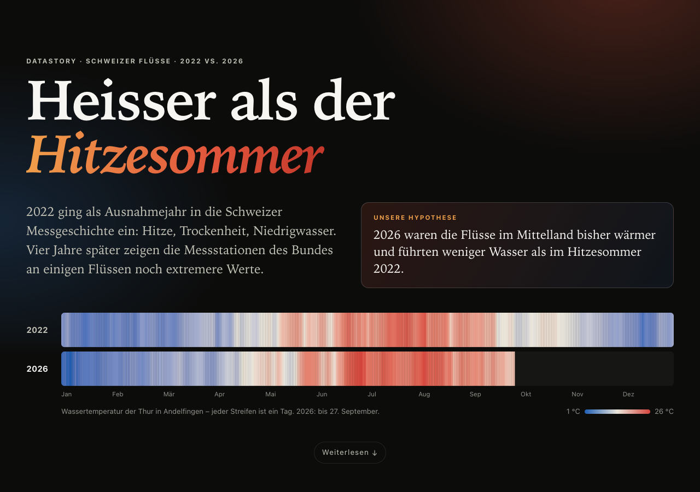
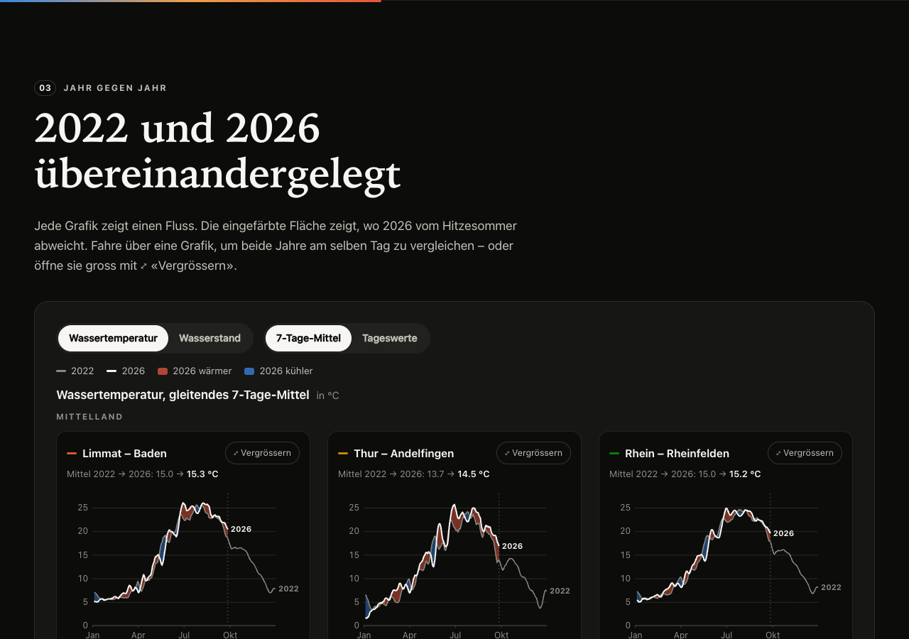
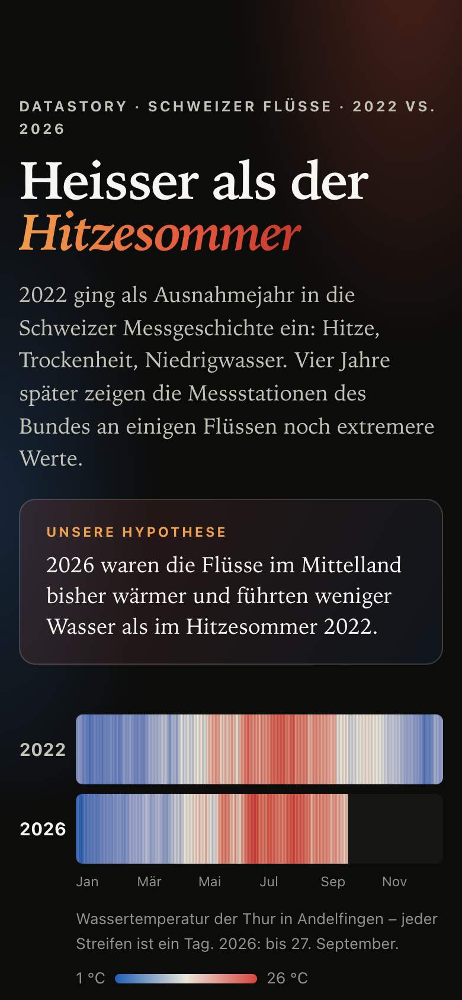
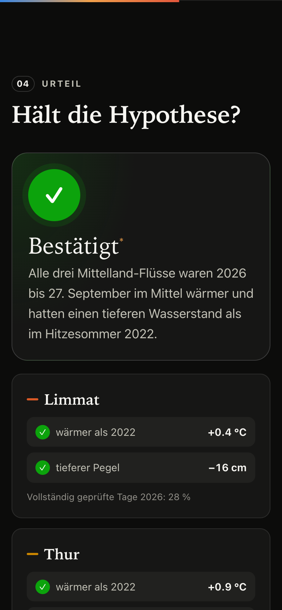

# Sechs Flüsse, sechs Temperamente

## Kurzbeschreibung

Die DataStory prüft die Hypothese, dass die Flüsse im Mittelland 2026 bisher wärmer waren und weniger Wasser
führten als im Hitzesommer 2022. Grundlage sind Tagesmittel von Wassertemperatur und Wasserstand an sechs
Messstationen des BAFU. Ein PHP-ETL-Prozess lädt die Daten täglich per Cronjob in eine eigene MySQL-Datenbank;
die Website liest nur daraus und vergleicht beide Jahre in interaktiven D3-Grafiken – mit drei Alpenflüssen
als Vergleichsgruppe.

## Learnings

- **Eine eigene Datenbank lohnt sich:** Die Website funktioniert auch, wenn die BAFU-API nicht erreichbar ist,
  und eigene Auswertungen (Monatsmittel, Jahresvergleiche) lassen sich direkt in SQL rechnen.
- **Den ETL-Prozess klar trennen:** Extract, Transform und Load in eigenen Dateien machen jeden Schritt
  einzeln testbar und nachvollziehbar.
- **Wiederholbare Importe:** Ein UNIQUE-Key zusammen mit `INSERT … ON DUPLICATE KEY UPDATE` verhindert Duplikate
  und übernimmt trotzdem nachträgliche Korrekturen des BAFU.
- **API zuerst untersuchen:** Mit GraphQL-Introspection (`__schema`) lassen sich die verfügbaren Felder
  zuverlässig ermitteln, statt sie zu erraten.
- **Zeitstempel genau lesen:** «UTC, Beginn des Intervalls» bedeutet beim BAFU, dass ein Wert mit `23:00Z`
  zum *nächsten* Kalendertag gehört.
- **Sicherheit von Anfang an:** Zugangsdaten gehören in eine eigene, per `.gitignore` ausgeschlossene Datei;
  Datenbankabfragen laufen nur über Prepared Statements.
- **Datenjournalistisch sauber arbeiten:** Vergleiche fair machen (gleicher Zeitraum pro Jahr, nur vollständige
  Jahre für Monatsmittel) und offen sagen, was die Daten *nicht* zeigen.

## Schwierigkeiten

- **10 000-Zeilen-Limit ohne Pagination:** Die BAFU-API lehnt grössere Abfragen ab. Gelöst mit berechneten
  Zeitfenstern und automatischer Halbierung, falls ein Fenster trotzdem zu gross ist.
- **Wasserstand in Metern über Meer:** Absolute Pegel (z.B. 570 m ü.M. in Brienzwiler, 198 m ü.M. am Ticino)
  sind nicht vergleichbar. Lösung: Abweichung vom mittleren Pegel jeder Station in Zentimetern.
- **Unklarer Freigabestatus:** Die API liefert neben 1/2/3 oft `null`. Dieser Wert wird als «ohne Status»
  gespeichert und auf der Website ausgewiesen.
- **Verdächtige Messwerte:** Bei Brienzwiler meldet die API im März 2026 drei Tage lang exakt 0.00 °C. Diese
  ungeprüften Werte werden als vermuteter Sensorausfall verworfen und erscheinen als Lücke.
- **Unvollständiges laufendes Jahr:** Für faire Jahresvergleiche wird jedes Jahr nur vom 1. Januar bis zum
  gleichen Stichtag gemittelt.
- **PHP-Eigenheit:** Numerische Array-Keys wie `'2019'` werden automatisch zu Zahlen – die Stationsnummer
  wird deshalb immer aus dem Datensatz gelesen.
- **Tooltips auf dem Handy:** Ein schwebender Tooltip verdeckte die ganze Grafik. Lösung: Auf schmalen
  Bildschirmen erscheinen die Werte in einem Panel unter der Grafik.
- **Deployment:** Zugangsdaten und Import-Token nur auf dem Server hinterlegen, sensible Dateien per
  `.htaccess` sperren und den täglichen Import als Cronjob im Hostpoint Control Panel einrichten.

## Ressourcen

- **Datenquelle:** Bundesamt für Umwelt BAFU, Datensatz «Hydrologische Beobachtungen» –
  https://api.data-platform.cloud.bafu.admin.ch/dataproduct-water-observations
- **BAFU-API und Dokumentation** (Filter, Pagination, Ratenbegrenzung, Lizenz):
  https://api.data-platform.cloud.bafu.admin.ch/ · GraphQL-Endpunkt https://data.bafu.admin.ch/api
- **Lizenz der Daten:** «Freie Nutzung. Quellenangabe ist Pflicht.» (opendata.swiss)
- **D3.js v7** für die Visualisierungen: https://d3js.org/
- **PHP-Handbuch, PDO:** https://www.php.net/manual/de/book.pdo.php
- **MySQL-Referenz, `INSERT … ON DUPLICATE KEY UPDATE`:**
  https://dev.mysql.com/doc/refman/8.0/en/insert-on-duplicate.html
- **Hostpoint Support, Cronjobs einrichten:**
  https://support.hostpoint.ch/de/produkte/webhosting/haeufig-gestellte-fragen/cronjobs-einrichten
- **Unterrichtsmaterial und Beispielprojekt** des Moduls «Interaktive Medien 3», FHGR
- **KI-Unterstützung:** Claude Code (Anthropic) bei Konzeption, Programmierung und Dokumentation

## Screenshots

### Desktop

### Mobile

  
  

## Foto des Marktstands

Folgt.
